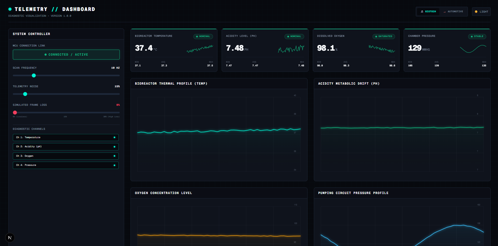
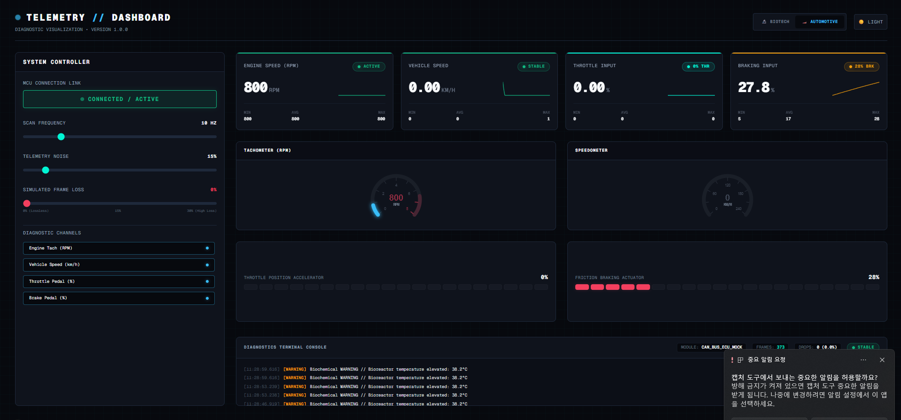

# Telemetry Dashboard

A real-time monitoring dashboard built with Next.js and TypeScript for visualizing simulated operational telemetry across biotech and automotive scenarios.

<!-- Optional badges -->


## Preview

### Biotech Process Monitoring



### Automotive Telemetry Monitoring



## Features

* Real-time simulated telemetry updates
* Historical charts for each monitored channel
* Current, minimum, maximum, and average values
* Nominal, warning, danger, and offline states
* Overall system-health calculation
* Packet-loss tracking and fault detection
* Per-channel visibility controls
* Drag-and-drop metric card ordering
* Reusable dashboard components across multiple monitoring scenarios
* Responsive interface for different screen sizes

> **Current status:** All telemetry is generated within the application. The dashboard is not yet connected to physical sensors, STM32 hardware, CAN, MQTT, or an external backend.

## System Status

The application evaluates both telemetry values and simulated communication reliability with simulation.

The overall system can report:

* **Nominal** — monitored channels are operating normally
* **Attention** — a channel enters a warning state or packet loss exceeds the warning threshold
* **Fault Detected** — a channel enters a danger state or packet loss exceeds the fault threshold
* **Offline** — the telemetry connection is disabled

Packet loss is calculated using the number of received and missed packets.

## Tech Stack

* Next.js 16
* React 19
* TypeScript
* Tailwind CSS
* React Context
* Vitest

## Architecture

```text
Simulated telemetry source
            ↓
useTelemetry hook
(metrics, history, packet tracking, status logic)
            ↓
TelemetryContext
            ↓
Reusable dashboard components and charts
```

## Project Structure

```text
app/
├── page.tsx
├── biotech/
│   └── page.tsx
└── vehicle/
    └── page.tsx

components/
├── DashboardShell.tsx
├── MetricCard.tsx
└── TelemetryChart.tsx

context/
└── TelemetryContext.tsx

hooks/
└── useTelemetry.ts
```

## Local Setup

### Prerequisites

Install:

* Node.js
* npm
* Git

### Quick Start

```bash
git clone https://github.com/se4nchoi/telemetry-dashboard.git
cd telemetry-dashboard
npm install
npm run dev
```

Open the dashboard at:

```text
http://localhost:3000
```

The root route redirects to the default biotech monitoring view.

### Production Build

```bash
npm run build
npm run start
```

## Usage

After opening the dashboard:

1. Use the navigation to switch between biotech and vehicle monitoring.
2. Observe the simulated telemetry values and historical charts updating over time.
3. Enable or disable individual telemetry channels.
4. Disconnect the simulated data stream to view the offline state.
5. Drag metric cards to change their display order.
6. Observe how warning, danger, and packet-loss conditions affect the overall system status.

## Current Limitations

The project currently focuses on frontend telemetry simulation and monitoring-interface design.

It does not yet include:

- Physical sensor or STM32 integration
- External communication through CAN, MQTT, WebSocket, or OPC UA
- A production backend with persistent telemetry and event storage
- Production features such as authentication, alerts, and anomaly detection

This repository should be treated as an exploratory telemetry-dashboard prototype rather than a production monitoring system.

## Roadmap

- Replace simulated telemetry with WebSocket or MQTT data
- Connect the dashboard to an STM32-based sensor source
- Add persistent event storage and configurable alert thresholds
  
## What I Explored

This project was built through an AI-assisted development workflow. While much of the frontend implementation was generated with Antigravity, I directed the project’s behavior, interaction design, and architectural evolution through iterative prompting, review, and testing.

Key ideas I explored included:

* Designing draggable metric cards so users can reorganize the monitoring interface
* Treating simulated packet loss as an operational fault signal rather than a purely visual metric
* Representing nominal, warning, fault, and offline system states
* Adding light and dark display modes for different monitoring environments
* Refactoring the dashboard around shared React Context state
* Reusing the same telemetry architecture across automotive and biotech scenarios
* Separating reusable dashboard components from scenario-specific labels, ranges, and content
* Evaluating where AI-generated implementation still required clearer requirements, testing, and architectural direction

The project gave me practical experience in directing an AI coding agent, reviewing the resulting system behavior, and turning an initial interface concept into a more reusable telemetry-dashboard architecture.

## Feedback

Bug reports and technical feedback are welcome through GitHub Issues.

## License

This project is licensed under the MIT License.
